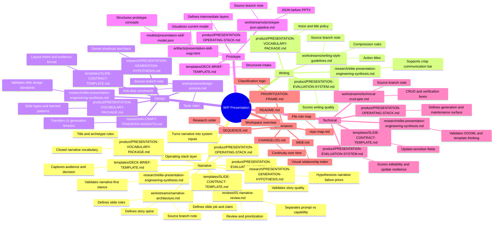
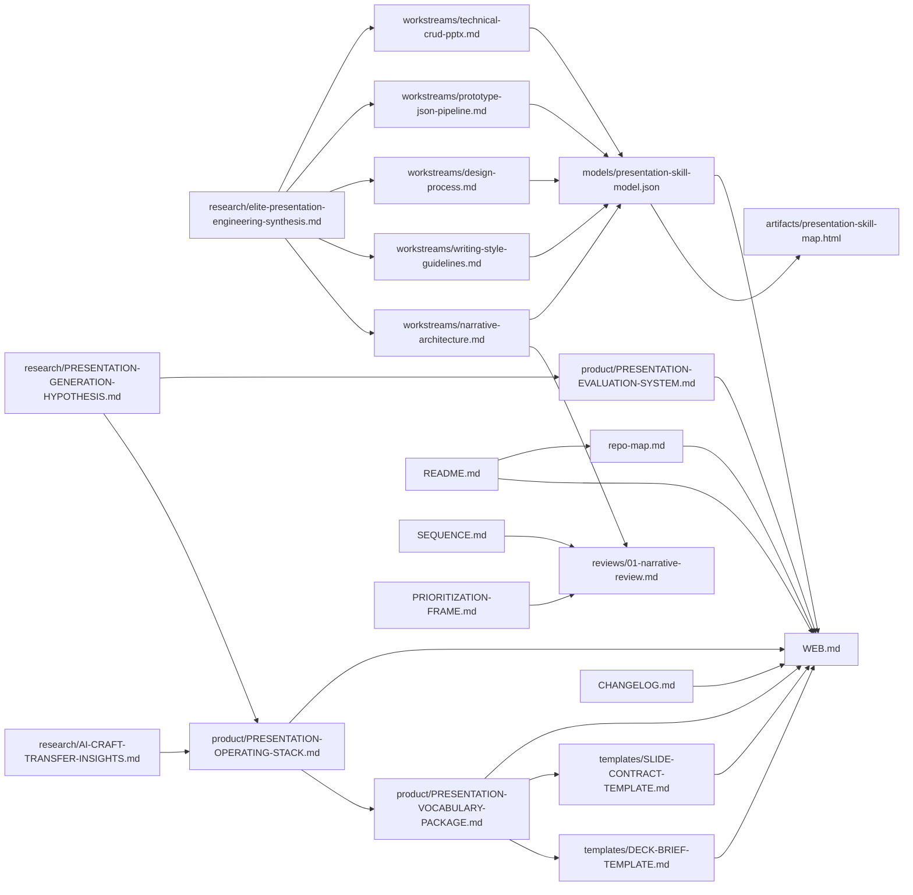

# Web

This file is the visual relationship map for the `wip-presentation/` workspace.

Use it to answer:

- which files connect to which pillars
- which files synthesize source material
- which files govern the research process
- which files validate, structure, or visualize the evolving skill concept

## Reading key

- `Source`: contributes raw or branch-specific thinking
- `Review`: evaluates and prioritizes
- `Model`: structures the concept
- `Artifact`: visualizes the concept
- `Governance`: helps navigate and maintain the workspace

## Pillar-to-file map

## Issue tree

```mermaid
flowchart TD
    ROOT[Main goal: shape a high-quality presentation skill]

    ROOT --> P1[Narrative branch]
    ROOT --> P2[Writing branch]
    ROOT --> P3[Design branch]
    ROOT --> P4[Prototype-first branch]
    ROOT --> P5[Technical PPTX branch]
    ROOT --> P6[Governance and tracking]
    ROOT --> P7[AI craft transfer layer]
    ROOT --> P8[Operating package layer]

    P1 --> P1A[Problem: generic AI covers topics but misses the argument]
    P1 --> P1B[Question: what narrative rules matter most]
    P1 --> P1C[Files]
    P1C --> P1C1[workstreams/narrative-architecture.md]
    P1C --> P1C2[reviews/01-narrative-review.md]
    P1C --> P1C3[research/elite-presentation-engineering-synthesis.md]

    P2 --> P2A[Problem: polished sounding copy often says very little]
    P2 --> P2B[Question: what writing rules are prompt-solvable]
    P2 --> P2C[Files]
    P2C --> P2C1[workstreams/writing-style-guidelines.md]
    P2C --> P2C2[research/elite-presentation-engineering-synthesis.md]

    P3 --> P3A[Problem: generic deck aesthetics create AI slop]
    P3 --> P3B[Question: what taste can be taught versus reviewed]
    P3 --> P3C[Files]
    P3C --> P3C1[workstreams/design-process.md]
    P3C --> P3C2[research/elite-presentation-engineering-synthesis.md]

    P4 --> P4A[Problem: deck structure is discovered too late inside PPTX]
    P4 --> P4B[Question: what should be modeled and rendered earlier]
    P4 --> P4C[Files]
    P4C --> P4C1[workstreams/prototype-json-pipeline.md]
    P4C --> P4C2[models/presentation-skill-model.json]
    P4C --> P4C3[artifacts/presentation-skill-map.html]
    P4C --> P4C4[product/PRESENTATION-OPERATING-STACK.md]

    P5 --> P5A[Problem: prompts alone cannot guarantee safe PPTX updates]
    P5 --> P5B[Question: what needs runtime capability and verification]
    P5 --> P5C[Files]
    P5C --> P5C1[workstreams/technical-crud-pptx.md]
    P5C --> P5C2[research/elite-presentation-engineering-synthesis.md]
    P5C --> P5C3[product/PRESENTATION-EVALUATION-SYSTEM.md]

    P6 --> P6A[Problem: research gets fragmented without durable maps]
    P6 --> P6B[Question: how do we keep decisions and files connected]
    P6 --> P6C[Files]
    P6C --> P6C1[README.md]
    P6C --> P6C2[SEQUENCE.md]
    P6C --> P6C3[PRIORITIZATION-FRAME.md]
    P6C --> P6C4[repo-map.md]
    P6C --> P6C5[CHANGELOG.md]
    P6C --> P6C6[WEB.md]

    P7 --> P7A[Problem: presentation prompting needs stronger system design]
    P7 --> P7B[Question: what transfers from AI-assisted UI generation]
    P7 --> P7C[Files]
    P7C --> P7C1[research/AI-CRAFT-TRANSFER-INSIGHTS.md]
    P7C --> P7C2[research/PRESENTATION-GENERATION-HYPOTHESIS.md]
    P7C --> P7C3[product/PRESENTATION-OPERATING-STACK.md]
    P7C --> P7C4[product/PRESENTATION-EVALUATION-SYSTEM.md]

    P8 --> P8A[Problem: prompting still drifts without a closed deck vocabulary]
    P8 --> P8B[Question: what upstream artifacts should exist before generation]
    P8 --> P8C[Files]
    P8C --> P8C1[product/PRESENTATION-VOCABULARY-PACKAGE.md]
    P8C --> P8C2[templates/DECK-BRIEF-TEMPLATE.md]
    P8C --> P8C3[templates/SLIDE-CONTRACT-TEMPLATE.md]
```

## File contribution map

## Contribution legend

### Validates

Files that support or reinforce a pillar:

- `research/elite-presentation-engineering-synthesis.md`
- `research/AI-CRAFT-TRANSFER-INSIGHTS.md`
- `research/PRESENTATION-GENERATION-HYPOTHESIS.md`
- `reviews/*.md`

### Structures

Files that impose order, classification, or schema:

- `SEQUENCE.md`
- `PRIORITIZATION-FRAME.md`
- `models/presentation-skill-model.json`
- `repo-map.md`
- `product/PRESENTATION-OPERATING-STACK.md`
- `product/PRESENTATION-VOCABULARY-PACKAGE.md`
- `templates/DECK-BRIEF-TEMPLATE.md`
- `templates/SLIDE-CONTRACT-TEMPLATE.md`

### Visualizes

Files that help inspect the workspace shape:

- `artifacts/presentation-skill-map.html`
- `WEB.md`

### Governs

Files that keep the workspace maintainable over time:

- `README.md`
- `CHANGELOG.md`
- `repo-map.md`
- `product/PRESENTATION-EVALUATION-SYSTEM.md`

## Update protocol

Update this file when:

- a new review file is added
- a new branch source file is added
- a model or artifact changes the workspace structure
- a file becomes obsolete, replaced, or reclassified

## Suggested next visual step

If this workspace grows beyond simple markdown maps, a stronger next artifact would be:

- an HTML dependency canvas showing files, pillars, and edge types
- filters for `source`, `review`, `model`, `artifact`, and `governance`
- status markers such as `active`, `superseded`, `needs review`, `validated`

That would be worth building once there are more branch reviews and more than one model or artifact layer.
